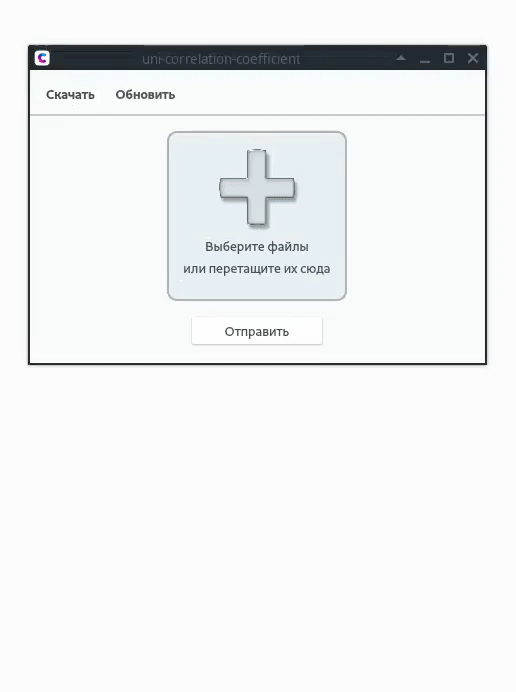
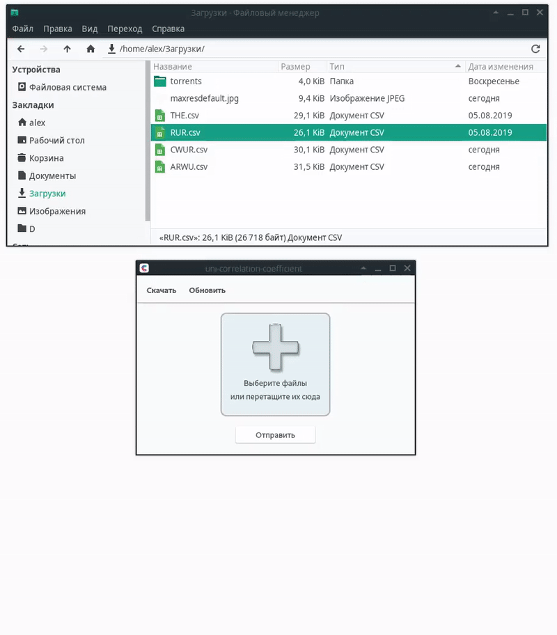
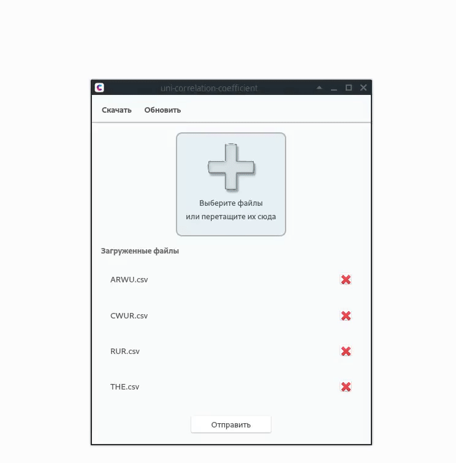
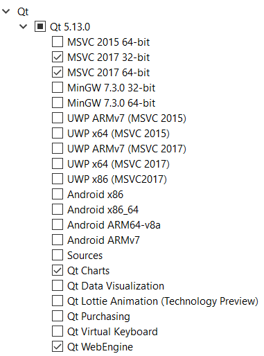
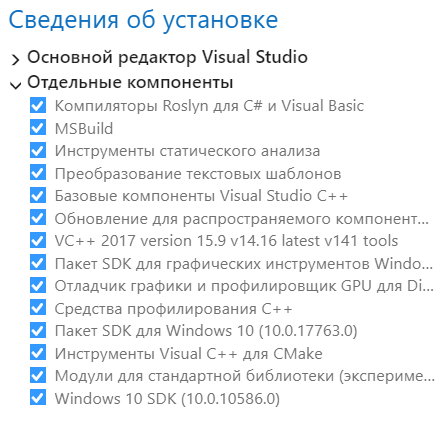

# Uni Correlation Coefficient

  

Программа с пользовательским интерфейсом для сравнения таблиц мировых рейтингов университетов с помощью вычисления [коэффициентов корреляции](https://ru.wikipedia.org/wiki/%D0%9A%D0%BE%D1%80%D1%80%D0%B5%D0%BB%D1%8F%D1%86%D0%B8%D1%8F) для каждой пары таблиц. 

В качестве коэффициентов корреляции используются коэффициенты [Спирмена](http://www.machinelearning.ru/wiki/index.php?title=%D0%9A%D0%BE%D1%8D%D1%84%D1%84%D0%B8%D1%86%D0%B8%D0%B5%D0%BD%D1%82_%D0%BA%D0%BE%D1%80%D1%80%D0%B5%D0%BB%D1%8F%D1%86%D0%B8%D0%B8_%D0%A1%D0%BF%D0%B8%D1%80%D0%BC%D0%B5%D0%BD%D0%B0), [Кенделла](http://www.machinelearning.ru/wiki/index.php?title=%D0%9A%D0%BE%D1%8D%D1%84%D1%84%D0%B8%D1%86%D0%B8%D0%B5%D0%BD%D1%82_%D0%BA%D0%BE%D1%80%D1%80%D0%B5%D0%BB%D1%8F%D1%86%D0%B8%D0%B8_%D0%9A%D0%B5%D0%BD%D0%B4%D0%B5%D0%BB%D0%BB%D0%B0) и коэффициент корреляции, вычисляемый методом обмена. С алгоритмами вычисления данных коэффициентов можно ознакомиться в папке [`src/dialog/Coefficients/<название коэффициента>`](./src/dialog/Coefficients).

# Функционал

В главном окне приложения реализована загрузка таблиц рейтингов с интернет-ресурсов:

- [The Academic Ranking of World Universities](http://www.shanghairanking.com/ARWU2018.html);
- [The Center for World University Rankings](https://cwur.org/2018-19.php);
- [Round University Ranking](http://roundranking.com/ranking/world-university-rankings.html#world-2019);
- [Times Higher Education](https://www.timeshighereducation.com/world-university-rankings/2019/subject-ranking/engineering-and-IT#!/page/0/length/-1/sort_by/rank/sort_order/asc/cols/stats).

<p align="center">
  
</p>

Информация о ресурсах считывается из конфигурационного файла [`config/web-resources.ini`](./config/web-resources.ini). Также поддерживается загрузка пользовательских таблиц с помощью формы загрузки в главном окне приложения. Загружаемые файлы помещаются в папку [`upload`](./upload). Перед чтением данных производится проверка расширений файлов. Программа работает только с таблицами формата [`.csv`](https://ru.wikipedia.org/wiki/CSV).

<p align="center">
  
</p>

После нажатия кнопки `Отправить` происходит чтение таблиц из загруженных файлов и вычисление коэффициентов корреляции. Происходит также сравнение таблиц друг с другом, в результате которого конечные таблицы содержат только одинаковые университеты, для обеспечения корректного последующего вычисления коэффициентов корреляции. Измененные таблицы хранятся в папке [`upload/changed`](./upload/changed).

Вычисленные коэффициенты отображаются в отдельном диалоговом окне `Результаты` в виде таблиц, разделенных на отдельные вкладки по названиям коэффициентов. Нажатие на ячейку таблицы вызывает диалоговое окно с [диаграммой рассеяния](https://ru.wikipedia.org/wiki/%D0%94%D0%B8%D0%B0%D0%B3%D1%80%D0%B0%D0%BC%D0%BC%D0%B0_%D1%80%D0%B0%D1%81%D1%81%D0%B5%D1%8F%D0%BD%D0%B8%D1%8F) для выбранной пары вузов. Нажатие на заголовок таблицы вызывают новое диалоговое окно, демонстрирующее измененную таблицу рейтингов для соответствующего института. Данная таблица поддерживает сортировку по рейтингам и названиям университетов. 

<p align="center">
  
</p>

Настройки приложения хранятся в файле [`config/settings.ini`](./config/settings.ini).

# Установка
## Автоматическая установка
### Windows

1. Загрузите последнюю версию установщика [`здесь`](https://github.com/BlasterAlex/Uni-Correlation-Coefficient/releases/latest);

2. Выполните установку программы, следуя указаниям установщика.

## Сборка из исходников
### Windows

1. Клонируйте этот репозиторий;
   
2. Установите Qt с [`официального сайта`](https://www.qt.io/download);

3. Установите необходимые пакеты через [`Qt Maintenance Tool`](https://doc.qt.io/qt-5/gettingstarted.html):

<p align="center">
  
</p>

4. Для сборки проекта на Windows используется компилятор [`MSVC`](https://ru.wikipedia.org/wiki/Microsoft_Visual_C%2B%2B), так как только он поддерживает работу с [`WebEngine`](https://wiki.qt.io/QtWebEngine). Для работы с MSVC необходимо установить следующие компоненты в [`VS Installer`](https://docs.microsoft.com/ru-ru/visualstudio/install/install-visual-studio?view=vs-2019):

<p align="center">
  
</p>

### Linux

1. Клонируйте этот репозиторий;

2. Установите Qt:
     - [`Ubuntu`](https://wiki.qt.io/Install_Qt_5_on_Ubuntu);
     - [`Arch`](https://www.archlinux.org/packages/extra/x86_64/qt5-base/).

2. Установите дополнительные пакеты:

   1. [`Qt Charts`](https://doc.qt.io/qt-5/qtcharts-index.html):

      - Ubuntu:
        ```
        $ sudo apt install libqt5charts5 libqt5charts5-dev
        ```
      - [`Arch`](https://www.archlinux.org/packages/extra/x86_64/qt5-charts/):
        ```
        $ yay -S qt5-charts
        ```

   2. [`Qt WebEngine`](https://doc.qt.io/qt-5/qtwebengine-index.html):

      - Ubuntu:
        ```
        $ sudo apt install qtwebengine5-dev
        ```
      - [`Arch`](https://www.archlinux.org/packages/extra/x86_64/qt5-webengine/):
        ```
        $ yay -S qt5-webengine
        ```
        
Для сборки необходимо перейти в корневой каталог проекта и выполнить команду:
```
$ qmake && make
# or
$ qmake && make -j4 # for multicore
```
